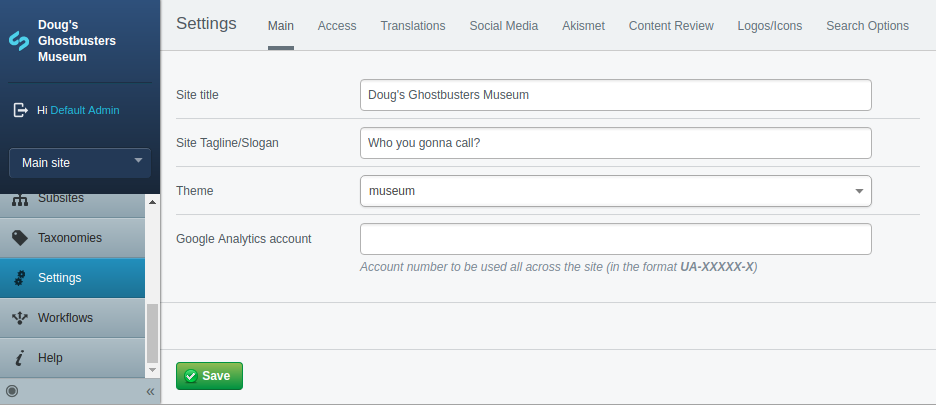
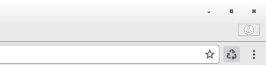

# Creating a Theme

The next step in SilverStripe development is choosing which theme you will base the website off. A good way to get started is to take a copy of one to the "out of the box" CWP themes and then modify it as needed. Alternatively you can find a theme on the SilverStripe add ons site http://addons.silverstripe.org

Out of the box, with the standard SilverStripe CWP install you only get a "Starter" theme which is intended for agencies creating websites for larger organisations with a strong brand etc where lots of customisations will happen, another option is the Watea theme - this is an enhancement to the Starter theme and is more fully featured, but more tricky to alter since you have to understand where to place the new files and make changes you want.

It's worth having both the starter and Watea theme available in the site to see and understand the differences, so from the root directory of your website, please run the following commands...

```
composer require cwp/watea-theme
composer require cwp/agency-extensions
```

This will install the watea theme.

## Git ignore the themes

You add/alter a couple of lines in the .gitignore file in the root directory of your website. We want to ignore the starter and watea theme since we will not be modifying these but taking a copy of the starter theme in a little while as the basis for our own theme.

Open the .gitignore file in your editor. Search for /themes as I believe there is already an entry for this, change that (and add a second line) like seen here...

```
/themes/starter_watea
/themes/starter
```

Ensure the change is saved. Next run the following command in the terminal to check the these themes are not getting picked up by git.

```
git status
```

Neither of the themes should be listed, if you do see one or more of these themes listed under the 'Untracked files' heading then please double-check what you have typed in the .gitignore, there is likely a spelling mistake. Please correct this and re-run the git status command until they are no longer listed.

## dev/build

Lastly please run a /dev/build by going to the baseURL of your site in the browser and adding dev/build on the end. This will ensure the SilverStripe framework and cms knows about the new theme.

## Look at the site

Now load up the site in your browser. As you will see it looks different now with a Navy Blue header and footer.

# Creating our own theme

Time to create your own theme. We will base this off the starter theme, not the Watea theme, as we will add our own colours and other enhancements to the copy of the starter theme we take.

* To create a new theme, if your code editor is Atom, you can right-click on the themes/starter and choose Duplicate
* Then give it the name museum
* Run the /dev/build command in your browser

Congratulations you have just created a new theme. At the moment it looks exactly the same as the starter theme which is OK. We will make changes to the museum theme throughout the course.

## Changing the theme

Time to say bye bye to the Watea theme, lets change to the new museum theme we created. To do this go to the CMS of the site (remember you can access the CMS by putting /admin on the end of the base URL of your site in your browser - i.e. http://museum.local/admin



* Once you are logged in to the CMS, choose "Settings" from the main menu at the left. As you will see on the first (main) tab of the site settings, there is a dropdown to choose the theme.
* Select the museum theme
* Click Save near the bottom left of the screen
* In a new browser tab Visit the front-end of your website
* You should see it looks like the original Starter theme, with not much colour at all.

# Adding the theme to git

In this case because we are going to be making changes to the museum theme, its our theme, we DO want this checked in to the source control, so in this case we must NOT add anything to the .gitignore for it, but check it in instead.

## Removing existing git history

First we need to remove the existing git history from the museum theme. The starter theme was itself a module installed via composer, and because we copied the starter theme to make our museum theme, the git history of the starter theme was copied as well. This can be confirmed by on the command line changing in to the themes/museum directory. If you do a "git log" you will see some history that is not our own which is not what we want here.

So lets delete the existing git history. ENSURE you are in the theme/museum directory before running this command...

```
rm -rf .git
git log
```

The results of the git log should now show our own project history, confirming the pre-existing git information copied from the starter theme is now gone from our theme.

## Adding the theme to our repository

Now we can add the museum theme to our project. Return to the root directory of your site on the command line, a couple of "cd .." should get you back. Now run these commands to add the museum theme...

```
git status
git add themes/museum
git commit
```

Type a message such as "Created new theme", then press Ctl-X to exit the editor. Lastly do this command to push the change up to the project repository..

```
git push
```

# Altering our museum theme

Now lets have a little bit of fun and alter something in the museum theme to make it our own. Lets just do something simple such as changing the background colour of the header.

The way I am going to show you is the easy way where we just modify the CSS file directly, there is a more powerful but more complex way using Webpack and Laravel Mix to parse something called SCSS and create our main.css file for us.

This requires some set up and additional knowledge which may distract from learning about SilverStripe itself, so we will not be using that in this course. More experienced developers should probably take a look at: https://www.cwp.govt.nz/developer-docs/en/1.7/working_with_projects/customising_the_starter_theme and use the workflow suggested there on projects they create (not this course).

## Changing the site header colour

In this case all we are going to do is change the colour of the header of our site. Later in the course we may make other changes, though most will be altering or creating SilverStripe template files.

* OK open this file: themes/museum/dist/css/main.css
* Find .site-header
* Add this line, or something similar (i.e. pick a colour you like) to the css for it: background-color: #c9d9ff;

Ensure the change is saved, now refresh the site in your browser. You may need to do a forced refresh Ctl-F5 to ensure the latest CSS is rendered. Most browsers cache CSS and JavaScript pretty severely which is annoying for web development where you are making changes all the time.

# Refresh Tip

A little tip I have for you, which will make your development life so much easier, is to install an extension for your web browser which adds a button allowing you to fully refresh a page with one click. In Chrome I use an Extension called "Clear Cache".  This adds a button to the right of the address bar near the options menu which looks like a recycling symbol. I would suggest that you go and find it or something similar when doing SilverStripe development, particularly when there are CSS or JS changes.



In our case, for this course, since we do very little in the way of CSS and no JavaScript it is not necessary to install clear cache or something similar. This is just something to bear in mind.

Also worth a mention is the Disable Cache option in the developer tools, this can also help with clearing cache, but will require you to open the dev tools and turn it on, and then its active for all page loads.


# Adding and committing the colour change

Similar to earlier I want you to add and commit the change to the main.css. To do this run the following commands from the root directory of the site on the command line.

```
git status
git add themes/museum/dist/css/main.css
git commit
```

Enter your commit message, such as "Added header background colour" and then Ctl-X the editor. Finally run this to commit the change.

```
git push
```

# Further reading/references

* SilverStripe add ons http://addons.silverstripe.org
* Working with the starter theme https://www.cwp.govt.nz/developer-docs/en/1.7/working_with_projects/customising_the_starter_theme
* Slightly older 'default' theme https://github.com/silverstripe/cwp-theme-default (I think it looks nicer)
* Clear cache chrome extension https://chrome.google.com/webstore/detail/clear-cache/cppjkneekbjaeellbfkmgnhonkkjfpdn?hl=en

# Next

[Lesson 04 - Creating a new Page Type](04_CreatingANewPage.md)