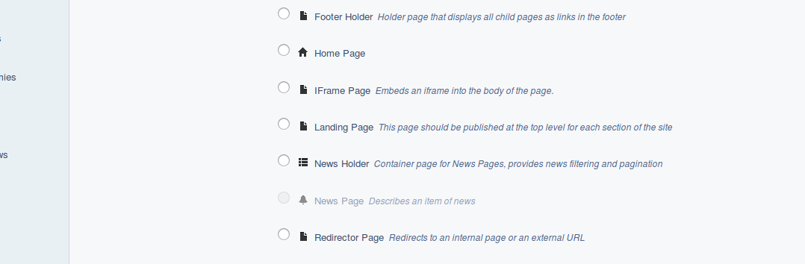

# Existing page types

In this lesson we will create our first new page type for use in the site, but first its probably best to look at what page types come out of the box in CWP SilverStripe as there are a lot. The best way to see a list of them is to log in to the CMS of our site but putting /admin on the end of the base url, i.e. http://museum/admin then log in with "admin" and "password".

Ensure the Pages option is selected at the top of the left menu, then click on the "(+) add new" button near the top of the screen.


Here you can see a list of the built in page types, some ones of mention are...

* Page - this is a normal generic page where content can be entered in a WYSIWYG editor (powered by TinyMCE)
* Event Holder - this page type is provided by CWP and is a listing type of page for events added underneath
* Footer Holder - can be used to control the links displayed in the footer of the site
* Home page - normally only one of these in the site
* News Holder - very similar to event holder but for news
* Redirector page - redirects users to a specified page in the site, can be helpful in the footer to make the link go to a page in the site, or to manage changes to site structure so users don't get a 404 error, or to allow short urls in social media / marketing for a page deeper in the site
* Sitemap page - automatically displays a sitemap of the site, handy to add to the footer via the footer holder
* User defined form - allows CMS users to create pages containing a form, such as contact us, basic surveys etc.
* Event and News pages - these are for entering the details of the event or news item, they are greyed out because they can only be added under their holder page.

So as you can see this gives you a lot out of the box; Basic pages, News, Events, Sitemap etc. There is also the Blog pages if that is something you are interested for you site.

One main thing which is missing, and that we will be creating now, is a Landing type of page for each section of your website. I.e. a pages which sit below the home page, but above the general content pages. The plan for this landing page is to list the pages underneath, so providing an easy way for people to navigate your site.

# Creating the landing page

Normally new page types you create inherit from the "Page" (generic) page type, so an easy way to get going is to duplicate the mysite/code/pagetypes/Page.php, you can do this easily in Atom by right-clicking on it in the project tree and then clicking "Duplicate". Change the file name to "LandingPage.php". Alternatively just create a new file in your favourite editor and copy and paste in the code from the Page.php

Once this is done, in the newly created LandingPage.php file you must edit the class names to include the word Landing, and also change it extend Page for example...

```php
class LandingPage extends Page {
    private static $db = array();
    private static $has_one = array();
}

class LandingPage_Controller extends Page_Controller {
    private static $allowed_actions = array();
}
```

## Page Class and Controller class explained

You may have heard of MVC before, if not it stands for Model-View-Controller and is quite a common and well regarded way to organise the code structure of a CMS or other PHP framework. Often the code for these 3 things are in separate files, 1 file for the Model (think of this as the database structure), 1 file for the View (the code to render the HTML), and 1 file for the Controller (contains the business logic, connects the DB model with the view).

In SilverStripe 3.x, the Model and the Controller classes are in the same file with the top one containing the model which is why, as you may have noticed, there is an array called $db, and the bottom class being the controller hence the \_Controller postfix in the name.

# dev/build


Even though the LandingPage.php file is reasonably bare, it contains the minimum required* for a new page type to appear in the CMS, but only after you run dev/build to update the database. To do this add /dev/build to the base URL of your website in your browser. Once that is done in the CMS reload and then click the "(+) Add new" button in the pages section, you should see a page type called "Landing Page" in the list of options.

* \*Note the $db, $has_one, and $allowed_actions arrays are not actually needed either if you really want just a new page type in the CMS with no additional functionality on top of the page it extended.

# Adding a description

As you may have noticed in the list of pages in the CMS, there is no description for you page to the right of it's name. Lets add one to help describe to a CMS user what the type of page is to be used for. To do this add the following line inside the LandingPage class on a line before the $db array...

```php
private static $description = 'For each main section of the website';
```

Do the dev/build again in your browser - we will be doing this a lot so I like to keep a browser tab open with the /dev/build URL, its then as easy as refreshing this page in the browser to apply the changes rather than having to type dev/build from scratch each time.

Reload the Add New Page in the CMS and you should see the Landing Page in the list now has a nice description like the out of the box pages included in SilverStripe and CWP.



You have just created your very first page type. But wait, what about the V part of MVP? the template? We'll get to that we a little while, first lets discuss the ORM and database structure...

# The ORM and Database Structure

## ORM

SilverStripe uses an ORM system for the database, ORM stands for Object Relational Model, and from a development perspective this means you create objects in code such as pages and other dataobjects and SilverStripe will take care of creating the Database tables for them. As a developer you don't have to design and create DB tables when using SilverStripe.

Also the ORM system means that as a developer, you can write pretty high level code to create, read, update, delete (CRUD) your pages and other dataobjects rather than needing to write raw SQL or build sql queries using "Active Record" style syntax (though both these of these methods are available if needed).

For example to retrieve a DataList of all landing pages ordered by Title somewhere in your code you can simply do as follows

```php
$pages = LandingPage::get()->sort('Title');
```

And to retrieve and update a record you can do you like this

```php
$facility = Facility::get()->byID(2);
$facility->Title = 'Barbecue';
$facility->write();
```

The SilverStripe docs have this very succinct explanation of what the SilverStripe ORM means

* Each database table maps to a PHP class
* Each database row maps to a PHP object
* Each database column maps to a property on a PHP object

Because SilverStripe creates and maintains the database structure, this is why its necessary to run dev/build after creating, removing, or altering a class or its properties so the DB tables and columns stay in sync with what is defined in the code.

The benefits of using the ORM are that as well as it making your development quicker and easier, it allows other code to hook in to different events (example: onBeforeWrite), and means its pretty easy to change the database your site runs on since SilverStripe takes care of writing the actual SQL statements.

## dev/build

You can run the dev/build task by visiting the base url of your site with /dev/build added on the end while logged in to the CMS as an administrator. For example http://museum.local/dev/build

The task compares the current database to the classes defined in code and will perform the following changes if necessary

* Create any missing tables
* Create any missing fields
* Create any missing indexes
* Alter the field type of any existing fields
* Rename any obsolete tables that it previously created to obsolete(tablename)

A couple few important things to note is that the task won't delete tables or delete columns from tables no longer used. It will also ignore any tables it does not recognise so long as the names of those tables don't match that of a SilverStripe class.

### When to dev/build?

Cases when you need to dev/build are...
* You have created a new PHP code file, such as a new Pagetype
* You have made any changed which will affect the database such as adding or removing fields from the $db, $has_one, and some other arrays.
* You have created (or removed) a template file
* Changes to the config.yml file
* After installing a new module

Cases when a dev/build is not necessary (but not limited to)...
* Altering CMS fields in the getCMSFields() function
* Altering the HTML structure in an existing template file
* JavaScript or CSS changes

A simple refresh of the page should be sufficient in these cases, when there are JS or CSS changes a hard refresh (CTL-F5) might be needed.

## Table structure in the SilverStripe database

Now lets have a look at the table structure in a SilverStripe database. This is where the MySQL workbench application you should have installed earlier will come in handy.

### General

Many tables have an auto-incremented ID column, and auto populated Created, and LastEdited datetime fields.

### SiteTree

In terms of the page structure of the site, the most important table here is called SiteTree.

Site tree contains all the basic info about the page records, including the UrlSegment, Title, Content, Sort, ParentID and so forth.

You may also notice it contains a column called ClassName. This is because no matter the page type, a record will be created in the SiteTree table when a user adds a page via the CMS.

If you select * from the table to list all records (right-click the table in MySQL workbench and choose "Select Rows"), you should see a number of records with various class names: Page, ErrorPage, HomePage, and if you added a Landing Page in the CMS a record with the ClassName of LandingPage.

Another important thing to keep in mind about SiteTree and Pages you create is that SilverStripe will only create a new table for your page type if you have specified an additional field for that page type.

It will create a 1 to 1 relation between this new table and site tree, then when querying to get all the information about this table it will join the 2 tables together.

Just like pages defined in PHP subclass the Page class and you can specify new properties and methods in your child class, in the database, SilverStripe kind of does inheritance too with the "child" tables only containing the new columns.

At this stage because we did not add any new fields to the LandingPage class we created, no LandingPage table in the DB has been created. All the information about the LandingPage can be contained in the SiteTree table.

## DataObjects

The same system of "inheritance" can apply to Dataobjects as well, where if you have a child class of a dataobject you created, a child table will only contain the new fields.

Note with DataObjects there is no common table like there is with pages and the SiteTree table.

## More details

We will look at the database more throughout this course as we create Dataobjects, relations, and more CMS fields. The SilverStripe docs linked below contain heaps of information about the ORM.

# Further reading/references

* How to create pages in the CMS https://userhelp.silverstripe.org/en/3.6/creating_pages_and_content/pages/
* SilverStripe ORM and data model https://docs.silverstripe.org/en/3/developer_guides/model/
* Intro the ORM https://docs.silverstripe.org/en/3/developer_guides/model/data_model_and_orm/

# Next

[Lesson 05 - Creating a page Template](05_CreatingATemplate.md)