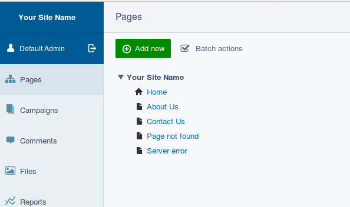

# Existing page types

In this lesson we will create our first new page type for use in the site, but first its probably best to look at what page types come out of the box in CWP SilverStripe as there are a lot. The best way to see a list of them is to log in to the CMS of our site but putting /admin on the end of the base url, i.e. http://museum/admin then log in with "admin" and "password".

Ensure the Pages option is selected at the top of the left menu, then click on the "(+) add new" button near the top of the screen.



Here you can see a list of the built in page types, some ones of mention are...

* Page - this is a normal generic page where content can be entered in a WYSIWYG editor (powered by TinyMCE)
* Event Holder - this page type is provided by CWP and is a listing type of page for events added underneath
* Footer Holder - can be used to control the links displayed in the footer of the site
* Home page - normally only one of these in the site
* News Holder - very similar to event holder but for news
* Redirector page - redirects users to a specified page in the site, can be helpful in the footer to make the link go to a page in the site, or to manage changes to site structure so users don't get a 404 error, or to allow short urls in social media / marketing for a page deeper in the site
* Sitemap page - automatically displays a sitemap of the site, handy to add to the footer via the footer holder
* User defined form - allows CMS users to create pages containing a form, such as contact us, basic surveys etc.
* Event and News pages - these are for entering the details of the event or news item, they are greyed out because they can only be added under their holder page.

So as you can see this gives you a lot out of the box; Basic pages, News, Events, Sitemap etc. There is also the Blog pages if that is something you are interested for you site.

One main thing which is missing, and that we will be creating now, is a Landing type of page for each section of your website. I.e. a pages which sit below the home page, but above the general content pages. The plan for this landing page is to list the pages underneath, so providing an easy way for people to navigate your site.

# Creating the landing page

Normally new page types you create inherit from the "Page" (generic) page type, so an easy way to get going is to duplicate the mysite/code/pagetypes/Page.php, you can do this easily in Atom by right-clicking on it in the project tree and then clicking "Duplicate". Change the file name to "LandingPage.php". Alternatively just create a new file in your favourite editor and copy and paste in the code from the Page.php

Once this is done, in the newly created LandingPage.php file you must edit the class names to include the word Landing, and also change it extend Page for example...

```php
class LandingPage extends Page {
    private static $db = array();
    private static $has_one = array();
}

class LandingPage_Controller extends Page_Controller {
    private static $allowed_actions = array();
}
```

## Page Class and Controller class explained

You may have heard of MVC before, if not it stands for Model-View-Controller and is quite a common and well regarded way to organise the code structure of a CMS or other PHP framework. Often the code for these 3 things are in separate files, 1 file for the Model (think of this as the database structure), 1 file for the View (the code to render the HTML), and 1 file for the Controller (contains the business logic, connects the DB model with the view).

In SilverStripe 3.x, the Model and the Controller classes are in the same file with the top one containing the model which is why, as you may have noticed, there is an array called $db, and the bottom class being the controller hence the \_Controller postfix in the name.

# dev/build


Even though the LandingPage.php file is reasonably bare, it contains the minimum required* for a new page type to appear in the CMS, but only after you run dev/build to update the database. To do this add /dev/build to the base URL of your website in your browser. Once that is done in the CMS reload and then click the "(+) Add new" button in the pages section, you should see a page type called "Landing Page" in the list of options.

* \*Note the $db, $has_one, and $allowed_actions arrays are not actually needed either if you really want just a new page type in the CMS with no additional functionality on top of the page it extended.

# Adding a description

As you may have noticed in the list of pages in the CMS, there is no description for you page to the right of it's name. Lets add one to help describe to a CMS user what the type of page is to be used for. To do this add the following line inside the LandingPage class on a line before the $db array...

```php
private static $description = 'For each main section of the website';
```

Do the dev/build again in your browser - we will be doing this a lot so I like to keep a browser tab open with the /dev/build URL, its then as easy as refreshing this page in the browser to apply the changes rather than having to type dev/build from scratch each time.

Reload the Add New Page in the CMS and you should see the Landing Page in the list now has a nice description like the out of the box pages included in SilverStripe and CWP.


You have just created your very first page type. But wait, what about the V part of MVP? the template? We'll get to that we a little while, first lets discuss the ORM and database structure...

# The ORM and Database Structure

//++ @TODO need to cover this here since templates lesson is quite long and don't come back and explain it in the lesson after.

- What ORM means in terms of the acornym and also for a developer
- Look in the DB and how tables are structured, starting with SiteTree then Page, and then any child classes of page etc.