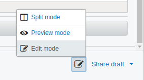
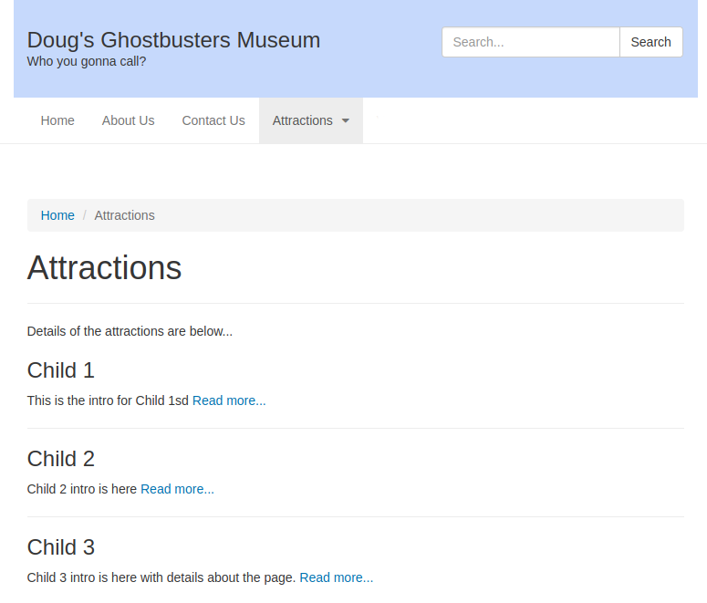

# Creating a New Page Template

In the last lesson, we did basically the minimum to create a new page type in the CMS; we created the Model and the Controller classes part of the MVC design pattern. In this lesson we will discuss how the page templates the V part work in SilverStripe.

If you have not done so already, actually create a new page of the type Landing Page by going to the Pages section in the CMS, clicking "(+) Add New" at the top, then selecting Landing Page.

Set the page name to "Attractions" then save and publish the page.

## TIP - turning the preview off

By default the preview pane is turned on the SilverStripe CMS, I don't like it as sometimes it can lie (as in not be a 100% accurate reflection of how the page looks in the front end), and also because with 4 panes
things on the screen can get a little cramped.

To turn the preview pane off, we can swap from Split Mode to Edit mode using a little Mode Switcher control down at the bottom-right of the screen. Hover over the icons down there an you should see a tool tip on one saying "Change View mode". Click on it to bring up a popup menu, then choose "Edit mode" from the list.



Now things should look a little better. You can still check how the page looks in the front-end of the site very easily by clicking on the URL segment field under the Page name near the top of the screen, this will open the page in a new browser tab and give you a 100% accurate, desktop sized look at the page, just now it will appear to users of the site when the page is published.

## Back to templates

As you should have seen when looking at the Landing Page you created called Attractions, it displays fine in the front-end of the site, the menus, title, content, and footer were all output, but why is this when we did not create a template file for this page type? Its because the templates in SilverStripe have some smarts where it will fallback to Page.ss if a specific page template is not found.

# Creating a LandingPage template file

Normally for each type of page you create in the site, as well as the PHP file with the Model and Controller Classes, you create a template (view) file with a .ss extension because normally you want different types of pages to display different things on them.

For example on the landing page, as well as the Content entered in the TinyMCE editor, below this we want to list the pages in that section of the site, allowing the user to click through to them. We might also want other things on landing pages which do not appear on generic content pages.

So lets create the template file. This is where the themes directory and the copy of the standard theme you created earlier comes in to play.

* Go in to the themes/museum/templates/Layout direcotry
* Create a new file (in Atom right-click on the Layout folder and choose 'New file'
* Call it LandingPage.ss
* Its very important the filename matches the name of the PHP class you want the template to be for, if the names do not match then the template will not be detected or used for the page.

Now we can add the HTML to the template, but first let me explain...

## Page.ss vs templates/Layout/Page.ss

Slightly confusingly there are 2 files called Page.ss in play in a SilverStripe site. The first, located in themes/starter/Page.ss, defines the structure for all pages in the site, it contains the opening HTML tag, the head section, includes the Header and Navigation, then includes - and remember this - the $Layout, and finally the footer, Google Analytics code, and closing HTML tags are output.

The second Page.ss file is in templates/Layout/Page.ss and is the layout for the generic Page type. The HTML defined in this file is included in the first Page.ss where the $Layout variable is located when the site is rendered.

Similarly for the Landing Page the LandingPage.ss template will be rendered where the $Layout variable appears in the Page.ss

## Adding the needed HTML markup to the LandingPage.ss

For this its best to open the themes/starter/templates/Layout/Page.ss and copy everything and paste it in to the LandingPage.ss file. This will ensure we have the correct divs and classes for the theme we are using as the base for our theme. Lets add one thing to this HTML markup to make it different than the generic page so we know our Landing Page Template is loading, before the $Content, in the section add a paragraph saying "this is the lading page template" as seen below...

```html
<div class="row">
    <section class="col-md-7 col-md-offset-1">

        <p><strong>This is the landing page template</strong</p>

        <% if $Content.RichLinks %>
            $Content.RichLinks
        <% else %>
```

Now save the changes to this file. Time for another dev/build, this time it is required for SilverStripe to detect the template file as it seems to keep a record of which ones exist and this is only updated when a dev/build is done.

Now visit the Attractions Landing Page you created earlier, should see in bold before the content you entered in the CMS editor "This is the landing Page template". This proves that the site is detecting the template file we created.

# Finally outputting child pages

First in the cms we should add 3 child pages, of the type (generic) Page. For now simply give them a name of Child 1, Child 2, and Child 3, this can all be updated later in the CMS to names of real attractions when we create a page type specifically for that. Also you should give then some content in the Content field, something simple like "page content is here" will do for now. Save and Publish these pages.

Now back in to the template code, the LandingPage.ss, remove that paragraph added earlier saying "this is the landing page", that was just for a test to double-check our template is being detected. Now its time to loop through and output the child pages of this landing page by adding this code inside the main <section> below the $Content is output.

```html
<% loop $Children %>
    <div>
        <h3>$Title</h3>
        <p>$Content.LimitCharacters(50)
            <a href="$Link">Read more...</a>
        </p>
        <hr />
    </div>
<% end_loop %>
```

Save the change to the template file, dev/build, and then look at the Attractions landing page in the front-end of the site. You should see the 3 child pages listed with their title, the first 50 characters of the content, and a 'Read more...' link. If you click the link it should take you to the child page.



# Template conditional and loops

https://docs.silverstripe.org/en/3/developer_guides/templates/syntax/

As you would have seen from the template code above, SilverStripe allows you to output information from the model or controller class by using variables in the template code. For example $Title, $Content, and $Link output this information from the pages that are children of the landing page.

Any attribute of a class is available for output in the template, for example if you add an Intro field to the page, where the user can enter a short summary introducing the page, you can output this in the template simply by doing $Intro.

## Loops

Another thing you can do is loops where a section of the template is repeated. This is exactly what we did to loop though all the children of the landing page. Loops and conditionals (if else statements) are denoted with tags which begin and then end with an angle bracket and a percent sign like this...

```
<% loop $Children %>
```

And to end the loop you must do

```
<% end_loop %>
```

Inside the loop the "scope" is that of the child item, so when you use the variables $Title, $Content, and $Link what is output are the details of the child page, not the landing page.

## Conditionals

Conditionals are defined in the same way, with these anglebracket-percent tags. You can do If, else_if, else, and end_if like so..

```html
<% if $Intro %>
    <p>$Intro</p>
<% else_if $Content %>
    $Content
<% else %>
   <p>Sorry no information to display</p>
<% end_if %>
```

As expected you can test if something equals or does not equal a condition, but note that "not" must be used rather than != for comparison. Also you can do greater than, less than tests with <, <=, >=, >

```html
// Equals
<% if $TimePeriod == '7Days %>
   <p>7 day data</p>
<% end_if %>

// Not equals
<% if not $TimePeriod %>
   <p>Unknown time period specified</p>
<% end_id %>

// Greater than
<% if $Results > 20 %>
   <span>Pagination...</span>
<% end_if %>
```

## Boolean logic

Also as expected, you can do boolean logic, for example requiring that 2 conditions are met before displaying something, or you can do an OR to display something if only 1 condition is set.
The double ampersand && means "and", the double pipe / vertical bar || means "or".

```html
// And
<% if $TimePeriod == '7Days' && $Format == 'List %>
    <table>etc..
<% end_if %>

// Or
<% if $ClassName == 'GardenEventPage' || $ClassName == 'EventDetailsPage' %>
   <p>Some content here</p>
<% end_if %>
```

## And more

There is also a lot more you can do in the templates, keep these in mind for later, we will use some, others may be suitable for your own projects...

* With
* Includes
* Calling functions

# Overriding templates

@TODO 2018-03-07: This topic needs expanding.

How overriding templates works needs to be discussed as important to know how to override core and module templates for pages etc. For now more details are at the link below...

https://docs.silverstripe.org/en/3/developer_guides/templates/template_inheritance/
