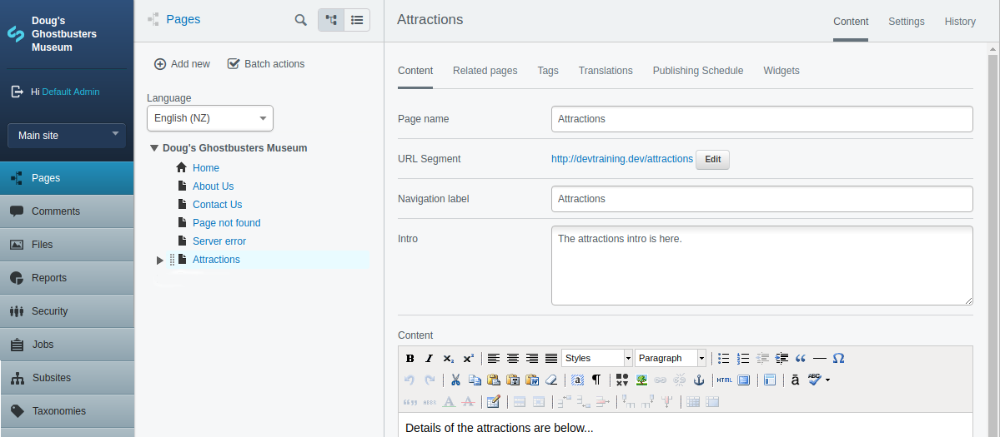

# Introduction to CMS fields

In this lesson I will introduce you to the database model and how to add fields in to the CMS for users to enter some information. We will then utilise these new fields on the landing page to make it even better.

# Adding an Intro field to Page.php

The first thing I want to do is to add an Intro field for all pages, above the Content field in the CMS. This intro field will be used for a short description about the page which can then be used on the landing page, the page itself, and other places in the site.

The intro field will be plain text, and have a shorter length that the Content field so there will be no issues about HTML stripping like there is with Content.LimitCharacters.

The steps to adding the field are 2 fold, the first is to add is as a property of the Page class using the $db array, the next is adding a field to the CMS for the user to enter the information, so..

* Open mysite/code/pagetypes/Page.php
* In the page class add the intro field to the $db array like this...

```php
private static $db = array(
    'Intro' => 'Varchar(255)',
);
```

The first part, in the single quotes is the field name, in this case 'Intro', the second part after the double arrow operator => is the field type in the database to use, so in this case a Varchar of 255 characters in length.

You can see all of the available database types on this page: https://docs.silverstripe.org/en/3/developer_guides/model/data_types_and_casting/ as you can see there are various types for numbers, text, etc - we will look at more of these later.

Now run dev/build, in the list on the dev/build page you should see some green to indicate that some fields have been created, but this is only in the database. If you load one of the Child pages of the Attractions page then you will not see any new field in the CMS yet to actually enter this information.

## Adding the CMS field

Now lets add a field in the CMS for users to actually enter the Intro for the pages. To do this we have to add a method called getCMSFields() to the Page model class (not the controller), please add the following to your Page.php in the Page class under the $db and $has_one arrays...

```php
public function getCMSFields()
{
    // Get parent fields.
    $fields = parent::getCMSFields();

    // Add intro before the content.
    $fields->addFieldToTab(
        'Root.Main',
        TextareaField::create('Intro', 'Intro'),
        'Content'
    );

    // Return the fields.
    return $fields;
}
```

Let me explain what is going on in this function, the first thing we must always do is call the function in parent class to get any CMS fields it creates, this gives us the page name, url segment, Content and other fields and saves us having to re-define these. If we forget this $fields = parent::getCMSFields(); line then things will be broken and an error will happen down at the next line since the is not a 'Root.Main' tab to add the text area field to.

Next we add a field for the Intro to the fields and we must specify what tab we want it in, Root.Main is the main tab displayed when the user first goes to the page, so this is a great place for all of the main, important information which must be entered for the page. You can put fields on other tabs too which might make sense in some cases for less important things, or to group sets of fields together rather than putting everything on the main tab and making the page in the CMS very long.

The last parameter of the addFieldToTab 'Content' simply tells the CMS to put the Intro field before the Content field, so when filling out the form the CMS user will enter the Page name, url etc, Intro, then Content which makes sense.

The last line of the function returns the $fields array to the code which called it. This will be code inside the SilverStripe cms folder in the root directory of your site. At this point the $fields array will contain all the fields from the parent classes plus the TextareaField we added to the main tab before the Content field.



Do a dev/build and then reload one of the Attractions pages, you should now see a field to enter an intro. Please do so for each of the attraction child pages, Saving and Publishing as in the next bit we will go back and alter the Landing page template file.

## Updating LandingPage.ss

Now lets use this new Intro field in the template as a plain text field is better to use for the intro rather than limiting the characters of the Content which can be a problem is there is HTML formatting such as bold, images, links etc in the first part of the content. In LandingPage.ss change this line in the loop of $Children $Content.LimitCharacters(50) to $Intro, so

```html
<% loop $Children %>
    <div>
        <h3>$Title</h3>
        <p>
            $Intro
            <a href="$Link">Read more...</a>
        </p>
        <hr />
    </div>
<% end_loop %>
```

Now visit the Attractions landing page in the front-end of you website. You might have noted that I did not say you needed to dev/build, that's because you do not; you can make changes to existing templates and they will appear after refresh without dev/build(ing). The intro you entered for the child pages will now be output.

# TIP - when to dev/build & when this not needed

Cases when you need to dev/build (but not limited just to these)...
* You have created a new PHP code file, such as a new Pagetype
* You have made any changed which will affect the database such as adding or removing fields from the $db, $has_one, and some other arrays.
* You have created (or removed) a template file
* Changes to the config.yml file
* After installing a new module

Cases when a dev/build is not necessary (but not limited to)...
* Altering CMS fields in the getCMSFields() function
* Altering the HTML structure in an existing template file
* JavaScript or CSS changes
* A simple refresh of the page should be sufficient, when there are JS or CSS changes a hard refresh (ctl-F5) might be needed.

# Summary

Well done! This concludes the lessons on how to create a page type in SilverStripe; you created all three parts of the MVC - with the Page (model) class, the page_controller, and also the template view for it. Also you learnt how to add fields in to the CMS for content authors to enter information.

Pages are a very big and important part of SilverStripe sites, you will be creating and extending pages and their templates a lot as a SilverStripe developer.

# Further reading/references

* SilverStripe data model types https://docs.silverstripe.org/en/3/developer_guides/model/data_types_and_casting/
* SilverStripe Form field types https://docs.silverstripe.org/en/3/developer_guides/forms/field_types/

# Next

[Lesson 07 - Installing a Module](07_InstallingAModule.md)