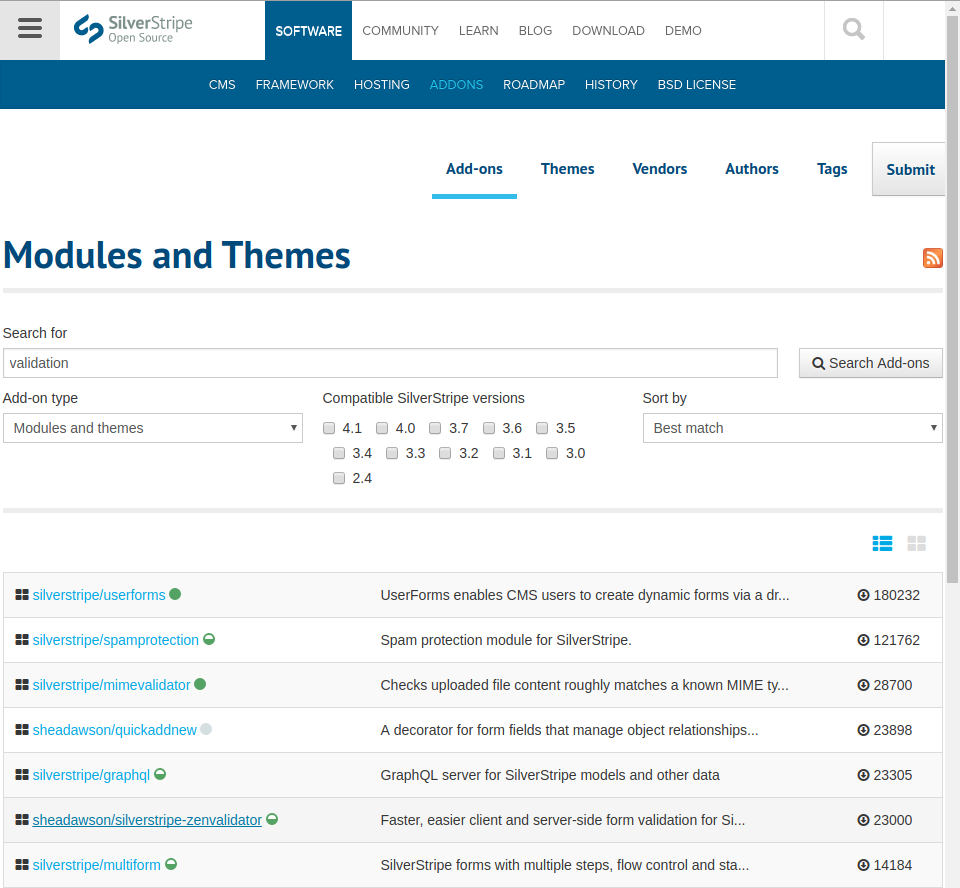
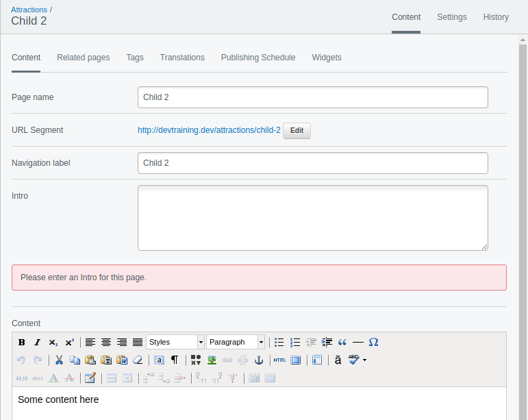

# Installing a Module

In this lesson we will look at installing a third-party module for SilverStripe, i.e. a module created by the community which provides features not in the core SilverStripe framework or CMS. We will then use this module, called Zen Validator, to validate some fields in the CMS.

## Where to find modules

Besides asking anyone familiar with SilverStripe if they know of a great module that does -something-, the best way to find modules is via the SilverStripe Add Ons page. http://addons.silverstripe.org/
It lists popular add ons and provides a search feature to help find modules.

Note you can also find themes via this website as well as modules to provide functionality.

# Exercise

* Open the add ons website http://addons.silverstripe.org/
* Enter "validation" in the Search for text box and press search
* Look down the list until you see "sheadawson / silverstripe-zenvalidator", we will be installing this module.
* Click on this module in the list, you will be taken to a details page where there is more of a description and also links to the home page of the module.



Normally modules are located on Github.com. If you are not familiar, GitHub is a Web-based Git version control repository hosting service. It is mostly used for computer code. It offers all of the distributed version control and source code management (SCM) functionality of Git as well as adding its own features.

# Installing the module

We will use Composer on the command line to install the module. The readme of modules on Github often have the composer command required to install it in your project, so click through to the module on github, the link is https://github.com/sheadawson/silverstripe-zenvalidator

As you will see in the installation section of the readme, the command to install it is as below. On the command line you must be in the root directory of your website (where the composer.json and lock files are). Run the command...

```
composer require sheadawson/silverstripe-zenvalidator
```

As you will see Composer will go off and install the module. It automatically updates the composer.json and composer.lock files for you. The changes to these should be committed to the repository used for your site so that if anyone else works on your website, or for yourself in future, when they clone down the repository for your site and run composer install they will also get the Zen Validator module installed.

## .gitignore

After the module is installed, if you do a "git status" on the command line you will see the composer.json and composer.lock files are listed as modified, but also that the entire zenvalidator directory is listed under the untracked files. Because Zenvalidator is a module installed via composer and not something we will be making changes in, we need to tell git to ignore it.

So. First on your command line run the following

```
git status
```

See the changed files and the untracked zenvalidator directory.

Now open in your editor the .gitignore file in the root directory of your site. As you will see most of the directories in your site are listed. Crucially the mysite and theme directories are not - because you are writing code in these 2 directories you want changes in them detected by git so you can commit the changes to the repository for your site.

At the bottom of the file, add the following and then save.

```
/zenvalidator
```

Now on the command line re-run the "git status" command and you should see that the zenvalidator directory is no longer listed, only the modified composer.json/lock files and now the .gitignore files are listed. Add and commit these changes to the repository for you site.

## Completing installation

Zen Validator is pretty easy to install and use, other modules may require config information to be entered in the mysite/config yaml file, but all we need to do to complete installation of Zen Validator is run the /dev/build command via your browser. You should always run /dev/build after installing a module, some may create additional tables in the database.

# What can Zen Validator do

You may want to have a quick read through the readme of Zen Validator - the "CMS Usage" section. All good SilverStripe modules will have documentation like this which details how to use it. Some times the docs are separate from readme and may be in a /docs/en folder in the Github repository. In our case, for now we are only going to use the "Required Fields" feature which allows us to specify the fields which are required to be entered in the CMS.

The required fields option is also available in the built in SilverStripe validator, but not all the other validation features available in Zen Validator, so in pretty much every project we have created over the last couple of years we have used this module. We will be using some of the other zen validation features later in this course.

# Making the Intro required

I think it would be great make the Intro added to the Page.php in the previous lesson required. That way there will always be some content to output on landing pages for the child pages. So in your editor lets open the mysite/code/pagetyopes/Page.php file.

As mentioned in the Zenvalidator readme, the way to specify the required fields is as follows. Please add this to the Page.php Page class (i.e. the model not the controller class).

```php
public function getCMSValidator()
{
    $validator = ZenValidator::create()->setConstraint(
        'Intro',
        Constraint_required::create()
    );

    // currently parsley validation doesn't work so well in the cms, so disable.
    $validator->disableParsley();

    return $validator;
}
```

Now go to one of the child pages in your site, under the attractions page, in the CMS and delete the intro and try saving the page. As you will see SivlerStripe now displays a red message box under the field telling you that the field is required.

You can customise the message displayed to something more descriptive, so lets do that by changing the following line in the code

```php
change...
Constraint_required::create()

to...
Constraint_required::create()->setMessage('Please enter an Intro for this page.')
```

And once again try to save a page in the CMS without an intro, this time rather than the default 'This field is required' you will see your message.



# Summary

So in this lesson we have really done 2 things

* 1) is find and install a module to provide additional functionality to SilverStripe, and
* 2) add some validation to fields in the SilverStripe CMS. Remember that as well as modules themes can be found via the http://addons.silverstripe.org

# Further reading/references

* SilverStripe add ons http://addons.silverstripe.org/
* Modules dev docs https://docs.silverstripe.org/en/3/developer_guides/extending/modules/
* Zen Validator Github https://github.com/sheadawson/silverstripe-zenvalidator

# Next

[Lesson 08 - Creating a DataObject](docs/08_CreatingADataobject.md)