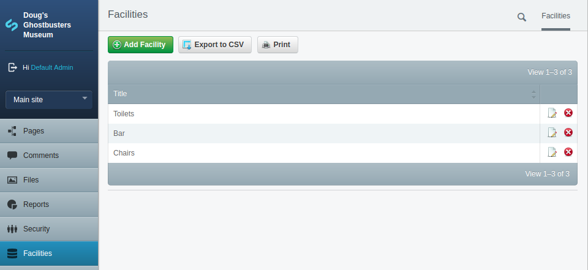

# Creating a DataObject

Over the next few lessons we will be creating another page type as well as a related DataObject used on the page. We will also be using a thing called a Gridfield which is a common way of managing related things in SilverStripe. And we'll take a look at some more template syntax.

# Data objects explained

As a developer, I find there are 2 types of things I create the most when building SilverStripe websites. The first are Pages (which we have already seen), the other is DataObjects which are also a class with properties and methods. Data objects are more low level, not as featured as pages. In fact if you follow the inheritance tree back far enough you will discover that pages are actually children of the DataObject class.

Unlike a page which represents a whole page in the site and contributes to the structure by appearing in the site tree. Dataobjects are useful containers for smaller bits of functionality which in many cases may not be that visual (and therefore don't have a corresponding template in the theme), and are not normally structural like a page.

For example, in this lesson we are going to create a Data Object for Venue Facilities, i.e. if there is a barbecue, toilets, playground, conference room etc. We don't need a whole page to detail these, only a class with a few fields such as the Title/Name of the facility and an icon. Venues (which will be a page type we create later) can have many different facilities so we will link them to Venue pages using one of the available relationships in SilverStripe and a Gridfield in the CMS for site admins to specify what facilities a venue has. Lastly when we come to creating the VenuePage template I will show you how to output the facilities the venue has.

# Lets get started

OK lets get started. In the Atom editor go to the mysite/code directory and right-click on the models folder (you should have created this earlier, if not then create the folder too) and create a new file, call it Facility.php. Note the use of the singular term Facility not Facilities. It is convention in programming to use singular names Objects and database tables and actually makes sense if you wanted to create a new facility object in code as the following line creates a new instance of ONE Facility object, not multiple (don't add this to the file).

```php
$barbecue = new Facility();
```

Anyway back to the Facility, Add the following to the file which is the boiler plate code needed to create the datamodel. We will add properties and methods inside the class as we progress though this lesson. Note how the Facility class extends DataObject (and not page like when we created that LandingPage).

```php
<?php
class Facility extends DataObject
{

}
```

# Adding the fields we want

Now lets add the fields we would like to the Facility class to hold the information we want about it. Facilities need a name which we will call Title and we want to be able to upload an icon to accompany the Title when its output in the front-end of the site. Remember as well as the DB fields we need to create the CMS fields admins of the site will use to enter the information.

```php
class Facility extends DataObject
{
    private static $db = array(
        'Title' => 'Varchar(50)',
    );

    private static $has_one = array(
        'Icon' => 'Image',
    );

    public function getCMSFields()
    {
        $fields = new FieldList(
            TextField::create('Title'),
            UploadField::create('Icon')
                ->setAllowedFileCategories('image')
                ->setFolderName('facility-icons')
                ->setDescription('The image must be 24 by 24 pixels.')
        );

        return $fields;
    }
}
```

This code contains a couple of things we have not seen before so let me explain them. Because images exist in the Files area of the CMS we don't add them as a DB field, instead we create a relation to them using $has_one and as the name suggest this means the Facility data object has one icon which is an image.

Also something different here than on pages is that you need to create the FieldList for the CMS fields to reside in. In this case a TextField for the title, and an UploadField for the Icon which allows the user to choose an image from their computer, or pick one which already exists in the Files area of the site.

The UploadField has a few options we can set using set() methods. In this case we specify that allowed types of file are images (so the user can't upload a document as the icon), we can specify the default folder in the Files section of the site the images will be uploaded in to (handing for keeping the files area tidy), and we can add a description which sits below the field in the CMS so provide additional information to the admin or content author that the image must be 24x24px.

Now you should run that dev/build command in your bowser. Remember this is the base url of your site plus /dev/build on the end, so possibly http://museum.local/dev/build Pay attention to the list of messages output on the screen, you should see a few lines in green saying that a table called Facility was created along with some fields for it.

# Creating an admin screen for Facilities

At present if you go to the CMS and look for your facility dataobject you won't find a way to create them. This is another big difference between DataObjects and Pages; pages can always be created via the Site Stree, but dataobjects have no singular place for creation by default. This is because they are often used on specific pages, so you would go to that page and create some data objects. An example is the home page of the site, once its page type is changed from just "page" to "Home page" you can add Quicklinks to it. These quicklinks are a dataobject provided by CWP.

Now, If you would like a place in the CMS for particular data objects to be viewed, created, updated etc which transcends pages, you can provide this by creating a Model Admin. As the name suggests this feature provides an Admin for our Models. We will create one of these now so we can create some Facility records for use later once we link them up to new VenuePage.

* In mysite/code directory, right-click on the admins folder and choose new file
* Call it FacilityAdmin.php
* Add the code below to this file...

```php
<?php

class FacilityAdmin extends ModelAdmin
{
    private static $url_segment = 'facilities';

    private static $menu_title = 'Facilities';

    private static $managed_models = array(
        'Facility',
    );
}
```

* Now run /dev/build
* And finally log in to the CMS of your website, or do a refresh if you are already logged in.
* In the main menu down the left you should now see an item called Facilities

If you click it you should now see an empty list of facilities and most importantly a green "Add Facility" button near the top-left of the screen.

Congratulations, you have just created a DataObject and a way of CMS users to CRUD (Create, Read, Update, Delete) Facility records.

* Click the Add Facility button and create one or 2 Facility records.



We will be doing more work on the Facility DataObject in a little while, in the next lesson we will create the VenuePage type and set up a many_many relationship between Venue pages and Facilities.

## Git commit

We created a lot in this lesson, you should do a git status on the command line and add the new directories to git (remember git add <filename>) and then commit these changes (git commit). Finally push these changes up to your repository (git push).

# A final couple of notes on Model Admins

If you have a few data objects which are related you can use the same Model Admin to manage them - you may have noticed that in the code above the $managed_models property is an array. In this case the model admin screen adds a tab for each model to the initial screen so you can choose between data objects / models to manage. Also in this case you can give the admin a more general $menu_title and $url_segment.

You don't have to have a model admin for your data objects. If they are quite closely tied to a particular page you can add a GridField to that page allowing for CRUD of model records there.

# Further reading/references

* SilverStripe Data model and ORM https://docs.silverstripe.org/en/3/developer_guides/model/data_model_and_orm/
* Model admins https://docs.silverstripe.org/en/3/developer_guides/customising_the_admin_interface/modeladmin/

# Next

[Lesson 09 - Creating another page - Venues](09_CreatingTheVenuePage.md)