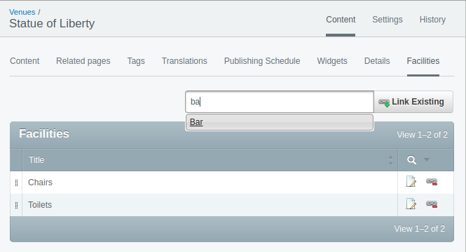
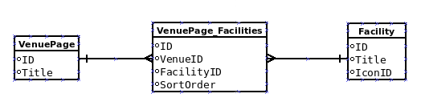
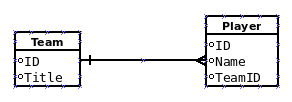
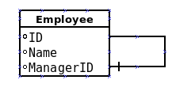
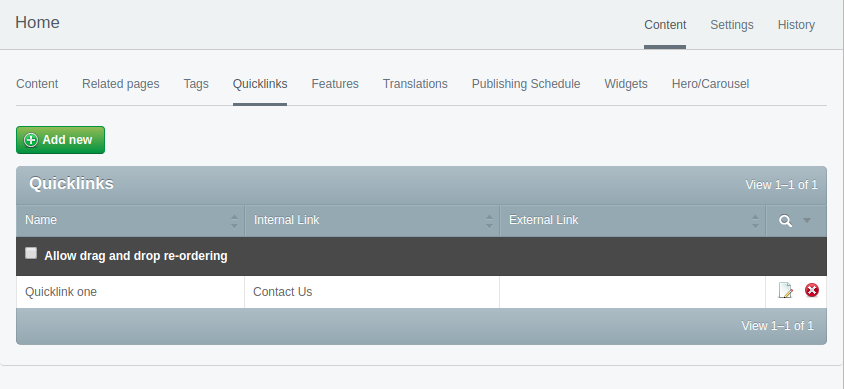

# Creating the Venue page

In this lesson we will create a new page type called VenuePage and set up the relationship between it and Facilities discussing the different types of relations in silverstripe as well as the different options for Gridfields.

* In atom right-click the mysite/pagetypes/LandingPage.php and choose duplicate
* Enter VenuePage.php as the name
* Change the name of the class at the top of the VenuePage.php to VenuePage
* Also change the \_contoller class name to VenuePage_Controller

Your VenuePage.php file should look like this..

```php
<?php
class VenuePage extends Page
{
    private static $description = 'For details about a venue';

    private static $db = array();

    private static $has_one = array();
}

class VenuePage_Controller extends Page_Controller
{
    private static $allowed_actions = array();
}
```

# Adding the relation to Facilities

Now lets add the relation to facilities. A Venue can have many facility and there can be the same type facility at many venues, so the correct type of relation to use here is many_many.

Add this code to the VenuePage

```php
private static $many_many = array(
    'Facilities' => 'Facility',
);
```

Save and run /dev/build and SilverStripe will create a joining table in the database called VenuePage_Facilities containing a column for the ID of the VenuePage and another column for the ID of the Facility record.

# Gridfield to manage venue-facility relations

Now we still need to add a field in to the CMS for users to see a list of facilities on a venue page. This is done with a Gridfield which is basically an HTML table listing any records related to the page and also buttons and other controls to add/update/delete or link and unlink existing facility records.

Add this code into VenuePage.php, VenuePage class

```php
public function getCMSFields()
{
    // Get parent fields.
    $fields = parent::getCMSFields();

    // Add the gridfield to a new tab called Facilities
    $fields->addFieldToTab(
        'Root.Facilities',
        GridField::create(
            'Facilities',
            'Facilities',
            $this->Facilities(),
            GridFieldConfig_RelationEditor::create()
        )
    );

    // Return the fields.
    return $fields;
}
```

Now in the CMS of the site create a Landing page at the top level called 'Venues', then under this create a Venue page. Give the venue page a name and fill out the other basic details and save and publish it. You should see tab called Facilities so click on it and you will see the gridfield. You can add existing Facilities created via the Model Admin screens by typing the name in the 'Find Facilities by Title' box and then selecting an item from the list and clicking 'Link existing'.



You will see the Facility you chose now in the list of facilities for the venue page. You can edit the details of the facility by clicking on it its row in the gridfield. Any updates you make will apply to this facility on any page it appears on because facility records are shared between venue pages.

To remove the facility from the Venue page, rather than deleting it, back on the gridfield we can choose Unlink to the right of its row in the table. This simply removes the relation between the page and gridfield; the facility still exists which can be confirmed by going to the Model Admin screens for Facilities accessed from the main menu on the left of the CMS interface.

# Types of relations

OK so that is the code for this particular case, but there are a few types of relations each best suited to different circumstances which we must discuss.

## Many Many

Lets re-cap the type we just used for Venues and Facilities, this was "Many Many" which means a VenuePage can have many Facilities, and a Facility (type) can be at many Venues. In the database a joining table with the VenuPageID and FacilityID is created.



### Many Many Extra Fields

A feature of the many_many relation is that because a new table, a joining table, is created in the database you can specify extra fields (besides the IDs) to go in to this table. One extra field I commonly use is SortOrder which will allow a CMS user to order the related records as desired, so in our case we can specify the order of the facilities for a particular Venue.

So lets do this. Add this code to the VenuePage after the $many_many array...

```php
private static $many_many_extraFields = array(
    'Facilities' => array('SortOrder' => 'Int'),
);
```

And inside the getCmsFields function add this line to the gridfield after the GridFieldConfig_RelationEditor::create()

```php
->addComponent(new GridFieldOrderableRows('SortOrder'))
```

Save, /dev/build and then bring up your venue page in the CMS (or reload it if you already have it open). On the Facilities tab you should notice that on the left of the rows of Facilities added to the gridfield that there is a small icon which kind of looks like :: or || if you click and drag this you can move rows up or down specifying the order of them. Under the hood this causes the SortOrder column in the VenuPage_Facilities table to be set for all records linked to the venue page. We can use this sort order later in the template for the Venue page to output the Facilities in the order the CMS user has specified rather than just the order in which the records appear in the database table.

## Has Many

This type is suited for when a thing has many of another thing, but the other thing belongs to only one of the first thing. For example if we had used has_many for the VenuePage and Facility relation then a Facility could only appear on one Venue page, they are not shared, so that would mean if all Venues had toilets you would need to create a Toilets Facility many times.

Has many is best when the related object can only belong to the primary object. In the database the relation is achieved by an ID column of the primary object being added to the related object's table. For example lets consider a sports team and sports players. A team has many players but a player can only belong to only one team at a time. In the database the Player table would have a TeamID column which is a foreign key (FK) to the Team table.



## Has One

This type of relation as the name implies is for when a thing has one of another thing. Example could be employees which have one manager. The database in this case is that a FK column exists on the table which has one to the other table. So to continue our example the employee table would have a managerID column with the ID of the manger. In this case the FK is probably back to the employees table since managers are also employees of a company.



As has-one is also the other side of a has-many relationship. Going back to our earlier Team and Players example, we can see a player has-one team.

# Types of gridfields

We should also discuss the types of Gridfield as there are a couple of different types, also its possible to add and remove components from Gridfields, for example you might want to remove the Add button so only existing items can be added to the gridfield.

The type of gridfield we used for the VenuePage is called a RelationEditor and that was specified by this line in the getCMSFields code for the gridfield

```php
GridFieldConfig_RelationEditor::create()
```

This type of gridfield is best suited to many_many relations so will be the type of gridfield you use the most, lets compare the three types of gridfields...

* GridFieldConfig_RecordViewer - Allows viewing readonly details of individual records.
* GridFieldConfig_RecordEditor - Allows editing of records contained within the GridField, instead of only allowing the ability to view records in the GridField.
* GridFieldConfig_RelationEditor - Similar to record editor but allows to search for existing records to add to the relationship, detach listed records from the relationship (rather than removing them from the database), and automatically add newly created records to it.

Because the RecordEditor displays a delete rather than an unlink icon at the end of the row, record editors are best when the related records are not shared, when they belong to the primary object with a has_many relation. If you would like to see an example of the RecordEditor type of gridfield then visit the Home page of your site in the CMS and choose the Quicklinks tab. Add a quicklink or 2 and you will see there is a red (x) icon at the right of the rows to actually physically delete the related records, whereas the RelationEditor we used has the unlink option instead.



## Adding and removing components

Its also possible to add and remove components from gridfields, we did this with the SortOrder where we appended to the gridfield config line a function call to add
a GridFieldOrderableRows component, i.e.

```php
GridFieldConfig_RelationEditor::create()
    ->addComponent(new GridFieldOrderableRows('SortOrder'))
```

You can also remove components from greidfields, for example to remove the add button. I often do this with the Relation Editor type of gridfield so CMS users must find and link existing records rather than creating another one which is same by mistake. The code for this is seen below. Add the ->removeComponentsByType('GridFieldAddNewButton') to the gridfield for the facilities for your venue page.

```php
GridFieldConfig_RelationEditor::create()
    ->removeComponentsByType('GridFieldAddNewButton')
```

The methods can be chained because we use the ::create() command. The Get CMS Fields function for you VenuePage should look like this...

```php
public function getCMSFields()
{
    // Get parent fields.
    $fields = parent::getCMSFields();

    // Add the gridfield to a new tab called Facilities
    $fields->addFieldToTab(
        'Root.Facilities',
        GridField::create(
            'Facilities',
            'Facilities',
            $this->Facilities(),
            GridFieldConfig_RelationEditor::create()
                ->addComponent(new GridFieldOrderableRows('SortOrder'))
                ->removeComponentsByType('GridFieldAddNewButton')
        )
    );

    // Return the fields.
    return $fields;
}
```

There is a great module called "gridfield extensions" see https://github.com/symbiote/silverstripe-gridfieldextensions which contains a number of useful components for gridfields you can use. I particularly like the GridFieldAddExistingSearchButton which gives a much more advanced and I believe user friendly way of linking existing items. We won't use that here, but you might want to check out this module at some point.

# Further reading/references

* Relations between records https://docs.silverstripe.org/en/3/developer_guides/model/relations/
* Gridfields https://docs.silverstripe.org/en/3/developer_guides/forms/field_types/gridfield/

# Next

[Lesson 10 - Venue page Template](10_VenuePageTemplate.md)