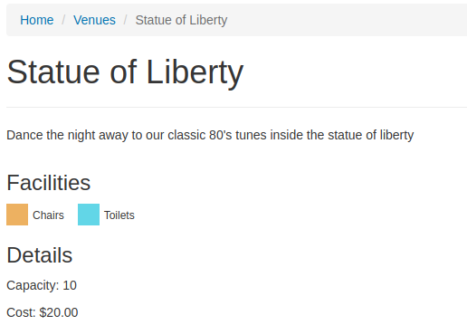

# Venue Page Template

In this lesson we will finally create the venue page template to output information about the venue including the facility information we have spent the last couple of lessons working on. I also want to use and discuss a few more database and CMS field types.

So lets start by doing the following...

* In Atom, in the site tree on the left, expand the themes/museum/templates/Layout
* Right-click the Page.ss and choose duplicate
* Call the file VenuePage.ss
* Ensure the new file is saved

We have just created our base template for venues from the standard page template. I think the first thing we will do is output the facilities to finalise up the work with that.

# Outputting the Facilities

So lets output the facilities which this venue has in the order specified by the CMS user since we added that SortOrder capability.

Add the following to the VenuPage.ss template in between the div containing the title and the div containing the content...

```html
<div class="row">
        <section class="col-md-7 col-md-offset-1">
            <p>$Intro</p>
        </section>
    </div>
    <div class="row">
        <section class="col-md-7 col-md-offset-1">
            <h3>Facilities</h3>
            <% loop $Facilities.Sort('SortOrder') %>
                <div class="facility">
                    $Icon
                    <span>$Title</span>
                </div>
            <% end_loop %>
        </section>
    </div>
```

Also add this line to the Div containing the content after the section but before the if richlinks

```html
<h3>Details</h3>
```

Now we need some styles to ensure the facility icons output nicely. Open themes/museum/dist/css/main.css and add these styles near the top of the file (anywhere after the @charset UTF8)

```css
.facility {
    float: left;
    margin-right: 15px;
}

.facility img {
    float: left;
    margin-right: 5px;
}

.facility span {
    float: right;
    font-size: 12px;
    margin-top: 5px;
}
```

Now dev/build and open the one of the venue pages you created earlier in the front end of the site. You should see the page title followed by the intro, then the facilities added to the page listed across, followed by the details which is the page content.

# More fields

Now lets add some more fields, I think it would be helpful to add Capacity and also the Cost of hiring the venue. So of course we will need to do 3 things: first add these as DB fields, then provide a CMS field for website admins to enter the information, and finally output these details in the front end of the site by including in the template.

Lets do these steps for both new fields at the same time. Change the $db array in the VenuePage.php to this..

```php
private static $db = array(
    'Capacity' => 'Int',
    'Cost' => 'Currency',
);
```

Now add the CMS fields for CMS users to enter the details. Note the use of number and currency fields rather than just plain textfields. These provide formatted input which assists the user in entering the correct thing. There are a range of form fields and I recommend taking a look at this page which describes them: https://docs.silverstripe.org/en/4/developer_guides/forms/field_types/common_subclasses/

Put this code before the code which adds the facilities tab. Notice how you can use add fields (with an S) to add multiple fields to a tab at once.

```php
// Add the capacity and cost fields to a new tab called Details
$fields->addFieldsToTab(
    'Root.Details',
    array(
        NumericField::create('Capacity'),
        CurrencyField::create('Cost')
    )
);
```

And now in the VenuePage template alter the code inside the details div adding the new things below..

```html
<h3>Details</h3>
<p>Capacity: $Capacity</p>
<% if $Cost > 0 %>
    <p>Cost: ${$Cost}</p>
<% else %>
    <p>Cost: Free</p>
<% end_if %>

<% if $Content.RichLinks %>
```

One thing to point out with the template code is the line ${$Cost}. Use the curly brackets was needed to output a dollar sign and then the value of $Cost (e.g. output is like $20.00). You can use these curly brackets in the template to help separate variable names when they need to run together with other variables or other text. Another example might be temperature, if you want to output 15deg then putting $Tempdeg in the in the template will not work, but {$Temp}deg will.



If you have not done so already, ensure that changes to all the files are saved, run /dev/build and enter the capacity and cost of the venues in your site. Also you should add, commit, and push your code changes to Github.
