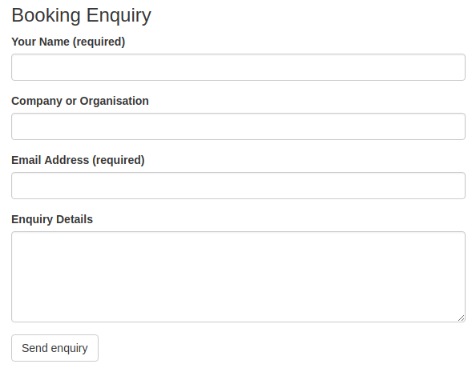

# Venue booking enquiry form

In this lesson we are going to create a form displayed on the venue page allowing the public to enquire about booking it. This will show you how to create and process forms in code. Its worth mentioning that there is the UserForms feature of CWP SilverStripe allowing CMS users to create their own forms, the trouble with that is the UserForms is its own special page type which does not contain any of the features we want for Venues (such as Facilities, Capacity, and Cost) so we can't use it here. Plus CMS users would have to create a form for each venue page which would be cumbersome.

There are a few steps to get the form set up, these all happen in the VenuePage_Contoller.

## Allowed Action

First I need explain $allowed_actions which is an array in Page_Controller classes which controls what methods in the controller can be accessed by people using your website to ensure that if they know the URL to the page and method they can't run things they are not allowed to.

Lets do a quick example to show how this works. Add this code to the VenuePage_Controller class...

```php
public function BookingEnquiry()
{
   echo "Hello, this is the enquiry function";
}
```

Save, dev build, and then bring up one of your Venue pages in the front end of you site. Then append /BookingEnquiry on to the url and press enter. You should see a message "Action 'BookingEnquiry' isn't allowed on class VenuePage_Controller." which is what we expect because we have not allowed access to this method using the allowed actions array (public/private does not control this), lets now do that to demonstrate how its required to allow access to methods of the controller even if they are public.

First lets make it so only admins can access the page, add this code below to the VenuePage_Contoller (or edit the exiting empty $allowed_actions array)...

```php
private static $allowed_actions = array(
    'BookingEnquiry' => 'ADMIN'
);
```

Save, /dev/build, and ensure you are logged out of the CMS. Then reload the VenuePage/BookingEnquiry in your browser and see what happens. Can you see the "Hello" message? No. Log in to the CMS in another tab and then reload the VenuePage/BookingEnquiry tab. You should now see the message. This demonstrates how you can restrict access to functions in front-end pages to only certain type of users.

This SilverStripe docs page explains $allowed_actions https://docs.silverstripe.org/en/4/developer_guides/controllers/access_control/ in more detail. The important thing for us is that in order for the Form we want to create to work, we need to allow it as an action, so lets update the $allowed_actions one last time to set the correct access control which is anyone can access the booking enquiry method

```php
private static $allowed_actions = array(
    'BookingEnquiry'
);
```

## Form creation in code

Now lets look at creating the form in code, we will do this inside the BookingEnquiry function. There are a few parts to form creation, these are as follows...

```php
$form = new Form(
    $controller,        // the Controller to render this form on
    $name,              // name of the method that returns this form on the controller
    FieldList $fields,  // list of FormField instances
    FieldList $actions, // list of FormAction instances
    $required           // optional use of RequiredFields object
);
```

In practise creating our Venue Booking Enquiry from looks like this, add this to the VenuePage_Controller...

```php
public function BookingEnquiry()
{
    // Create the fields to go on the form.
    $fields = new FieldList(
        TextField::create('Name', 'Your Name'),
        TextField::create('Company', 'Company or Organisation'),
        EmailField::create('Email', 'Email Address'),
        TextareaField::create('Details', 'Enquiry Details')
    );

    // Create the form actions - i.e. submit buttons.
    $actions = new FieldList(
        FormAction::create('sendEnquiry')->setTitle('Send enquiry')
    );

    // Specify the required fields.
    $required = new RequiredFields(array(
        'Name',
        'Email'
    ));

    // Finally put all this together and create the form.
    $form = new Form(
        $this,
        'BookingEnquiry',
        $fields,
        $actions,
        $required
    );

    // Return the form.
    return $form;
}
```

## Adding the form to the Template

Now lets output the form on the VenuePage near the bottom. Notice how to output the form we put the name of the function $BookingForm in to the template just like we would for properties of the VenuePage class...

```html
<div class="row">
    <section class="col-md-10 col-md-offset-1">
        <h3>Booking Enquiry</h3>
        $BookingEnquiry
    </section>
</div>
```

Save, dev build and load one of your venue pages in the front-end of the site. You should now see the form we created. SilverStripe takes care of creating all HTML mark up to display the fields for you. Don't fill the form in yet as there is actually one more step required before things will work completely.



## Function to process the form

As well as a function which creates the form, we need a function to do something with the information posted on the form, such as emailing the submission to us, or possibly saving the details in the database. We have not created this function yet, but did specify a sendEnquiry function when we defined the action earlier.

Please add this code to the VenuePage_Contoller below the BookingEnquiry() function...

```php
public function sendEnquiry($data, Form $form)
{
    // Message displayed to the user after the form has been submitted.
    $form->sessionMessage('Thanks, we will be in touch shortly.', 'success');

    return $this->redirectBack();
}
```

Save, /dev/build, reload the VenuePage in the front end of the site and fill out the form. After you click submit you should now see the "Thanks" message.

## Processing submitted form data

Obviously we should actually do something in the sendEnquiry function to get the data off the form. We well just use a basic Email function to send the submission on to ourselves.

Add this before the redirect back line, update the email address to yours.

```php
// The information submitted in the form is in $data. Lets send it to ourselves via email.
$from = "venue-booking@mysite.com";
$to = "<your email address here>";
$subject = $this->Title . " venue booking enquiry from " . $data['Name'];
$body = "Hi, there has been a new venue booking enquiry. \n";

// Loop and add a line for each of the sumitted fields.
foreach($data as $key => $val) {
    $body .= "\n" . $key . " : " . $val;
}

// Create new mail object and send the message.
$email = new Email($from, $to, $subject, $body);
$email->send();
```

Save, /dev/build and try the form out. See if you get emails when the form is submitted, it make take a few minutes to come through.

### If emailing does not work

Because you are just working locally emailing my not be configured or emails could be being sent but are being marked as spam because the from address does not match a real website. If this is the case, rather than spending ages trying to set up and configure emailing and trying to get through spam filters on our local machine, lets just output the email details to the screen. These changes will do that...

```php
// Create new mail object and send the message.
//$email = new Email($from, $to, $subject, $body);
//$email->send();

echo "<p>" . $subject . "</p>";
echo "<p>" . nl2br($body) . "</p>";

// Redirect back to the venue page the user just came from.
// return $this->redirectBack();
```